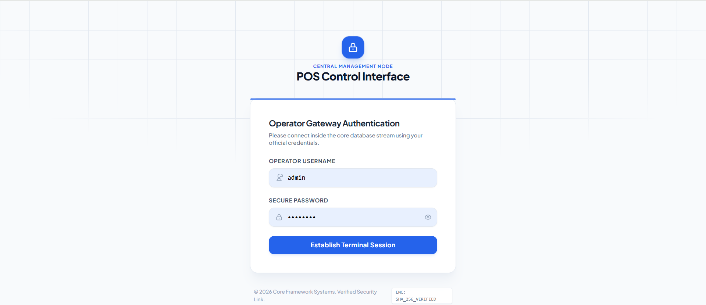
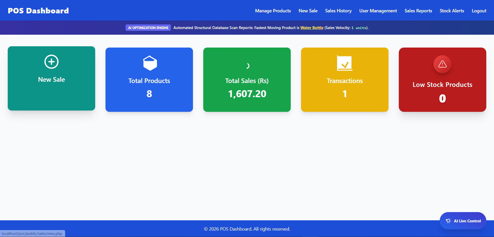
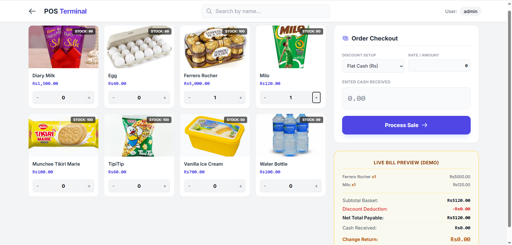
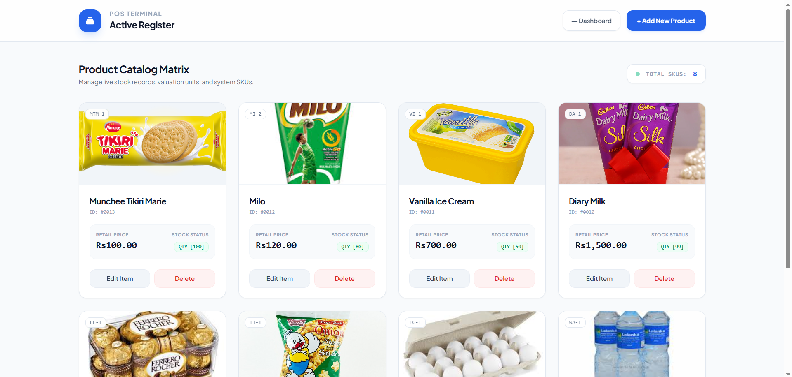
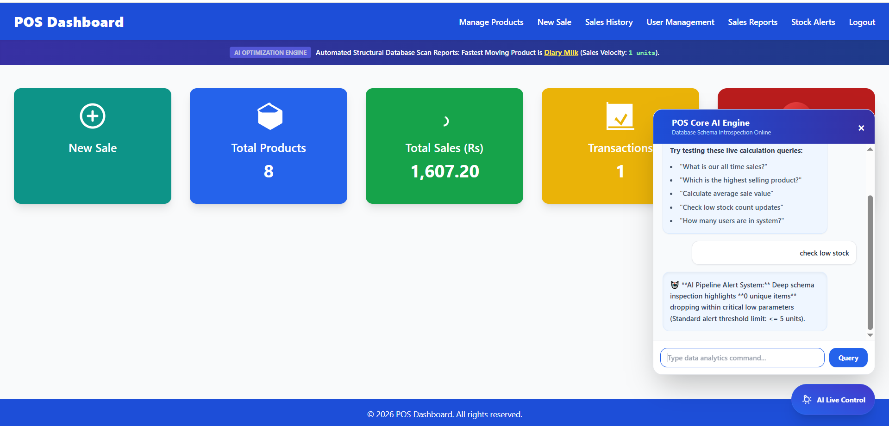

# 🚀 Smart POS System with AI Assistant

> A modern, intelligent, and secure Point of Sale (POS) System built using PHP, MySQL, Tailwind CSS, JavaScript, and AJAX.

Smart POS System is designed for small and medium-sized businesses to simplify inventory management, sales processing, reporting, and business analytics. The system includes AI-powered features such as intelligent chat assistance, sales prediction, and low-stock monitoring to help businesses make better decisions.

---

## 📸 System Preview

### 🔐 Login Page



### 📊 Dashboard



### 🛒 POS Sales Module



### 📦 Product Management



### 🤖 AI Assistant




---

## ✨ Features

### 🔐 Authentication & Security

* Secure Login System
* Session-Based Authentication
* Password Hashing using `password_hash()`
* PDO Prepared Statements
* SQL Injection Protection
* Role-Based Access Control
* Secure Logout
* Protected Routes & Middleware

---

### 📦 Inventory Management

* Add Products
* Edit Products
* Delete Products
* Product Categories
* Stock Tracking
* Inventory Monitoring
* Low Stock Detection

---

### 🛒 POS & Sales Management

* Fast Billing Process
* Real-Time Invoice Generation
* Sales History Tracking
* Daily Sales Reports
* Monthly Sales Reports
* Revenue Analytics
* Business Performance Monitoring

---

### 📊 Dashboard Analytics

* Total Products Overview
* Total Sales Summary
* Revenue Statistics
* Inventory Status
* Low Stock Notifications
* Sales Performance Reports

---

## 🤖 AI-Powered Features

### 💬 AI Chat Assistant

Interact with the system using natural language commands.

#### Example Queries

* How many products are low in stock?
* Show today's sales.
* What is the best-selling product?
* Show inventory status.
* Generate sales report.

---

### 📈 AI Sales Prediction

The system analyzes historical sales data and provides:

* Sales Forecasting
* Growth Predictions
* Revenue Estimation
* Business Insights
* Performance Recommendations

---

### ⚠️ AI Low Stock Monitoring

* Automatic Low Stock Detection
* Smart Warning Notifications
* Inventory Planning Assistance
* Stock Replenishment Suggestions

---

## 🛠 Technology Stack

| Technology      | Purpose              |
| --------------- | -------------------- |
| PHP             | Backend Development  |
| MySQL / MariaDB | Database Management  |
| Tailwind CSS    | UI Design            |
| JavaScript      | Interactive Features |
| AJAX            | Real-Time Operations |
| HTML5           | Frontend Structure   |

---

## 📂 Project Structure

```text
pos-system/
│
├── admin/
│   ├── dashboard.php
│   ├── products.php
│   ├── sales.php
│   └── reports.php
│
├── includes/
│   ├── db.php
│   ├── auth.php
│   └── functions.php
│
├── assets/
│   ├── css/
│   ├── js/
│   └── images/
│
├── screenshots/
│   ├── login.png
│   ├── dashboard.png
│   ├── pos.png
│   ├── products.png
│   ├── ai-chat.png
│   ├── low-stock.png
│   └── prediction.png
│
├── public/
│   ├── login.php
│   ├── dashboard.php
│   └── logout.php
│
└── README.md
```

---

## ⚙️ Installation

### 1. Clone Repository

```bash
git clone https://github.com/AflalMohamed/POS-Login-System.git

cd POS-Login-System
```

---

### 2. Create Database

```sql
CREATE DATABASE pos_system;

USE pos_system;

CREATE TABLE users (
    id INT AUTO_INCREMENT PRIMARY KEY,
    username VARCHAR(100),
    password_hash VARCHAR(255),
    role VARCHAR(50)
);
```

---

### 3. Configure Database

Open:

```php
includes/db.php
```

Update:

```php
$host = 'localhost';
$db   = 'pos_system';
$user = 'root';
$pass = '';
```

---

### 4. Run Application

```bash
php -S localhost:8000 -t public
```

Open:

```text
http://localhost:8000/login.php
```

---

## 🔑 Demo Login

```text
Username : Admin
Password : admin123
```

---

## 🛡 Security Features

✅ Password Hashing

✅ SQL Injection Protection

✅ Session Management

✅ Authentication Middleware

✅ Access Control

✅ Secure Logout

✅ Input Validation

✅ Error Handling

---

## 🚀 Future Enhancements

* AI Demand Forecasting
* Barcode Scanner Integration
* QR Billing System
* WhatsApp Notifications
* Email Notifications
* Multi-Branch Management
* Cloud Backup System
* Customer Loyalty Program
* Mobile Application

---

## 🤝 Contributing

Contributions are welcome.

1. Fork the repository
2. Create a new branch
3. Commit your changes
4. Push to your branch
5. Create a Pull Request

---

## 📄 License

This project is available for educational and commercial purposes.

---

## 👨‍💻 Author

### Aflal Mohamed

📧 Email: [mohamedaflal154@gmail.com](mailto:mohamedaflal154@gmail.com)

🐙 GitHub: https://github.com/AflalMohamed

---

## ⭐ Support

If you like this project, don't forget to give it a Star ⭐ on GitHub.

Your support motivates future improvements and new features.
